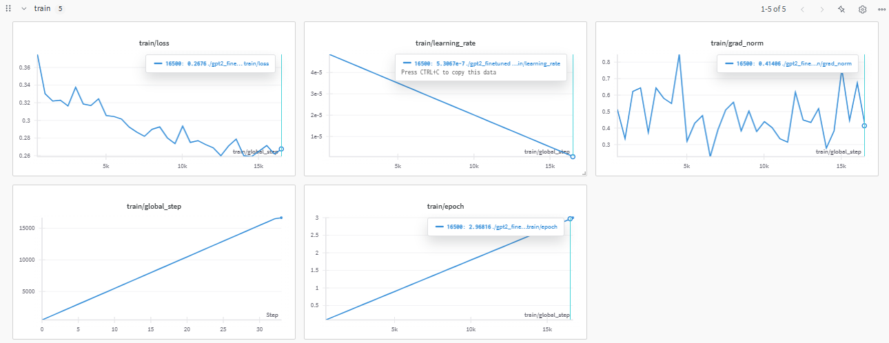
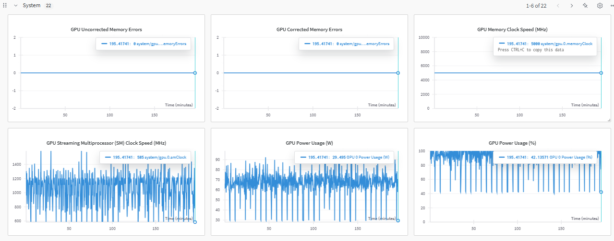
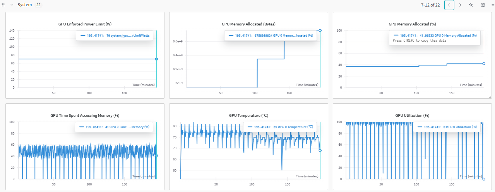
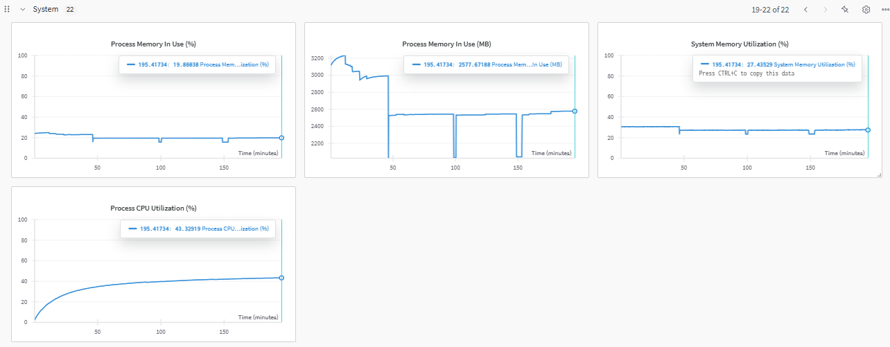
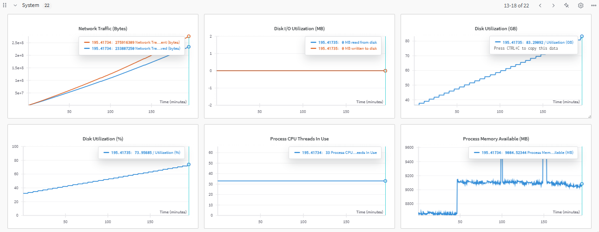

# GPT-2 Small Fine-Tuning

## 📄 Descrição
Este projeto demonstra o processo de fine-tuning do modelo GPT-2 small utilizando a biblioteca Transformers da Hugging Face e Google Colab (de forma gratuita com GPU T4).

## 🚀 Objetivo
Realizar o fine-tuning do GPT-2 (small - 124 milhões de parâmetros) em um dataset de diálogos (DailyDialog) para aprimorar a geração de texto em contexto de conversação.

## 🛠 Tecnologias Utilizadas
- Python
- PyTorch
- Transformers (Hugging Face)
- Datasets
- Accelerate
- PEFT
- Bitsandbytes

## 📂 Estrutura do Projeto
```
📦 GPT2_Fine_Tuning_Portfolio
├─ 📂 data/                # Dados utilizados no treinamento
├─ 📂 logs/                # Logs do treino
├─ 📂 images/              # Gráficos de desempenho e uso de recursos
├─ 📂 gpt2_finetuned/      # Modelo treinado e checkpoints
└─ GPT2_fine_tuning.ipynb  # Notebook do projeto
```

## 🔍 Métricas de Treinamento
Durante o treinamento, foram monitoradas as seguintes métricas:
- **Loss:** A perda diminuiu de forma consistente, atingindo ~0.2676 no final.
- **Learning Rate:** A taxa de aprendizado decaiu linearmente para estabilizar o treinamento.
- **Grad Norm:** O gradiente apresentou oscilações, mas sem comprometer a perda.

### 📈 Gráficos
Os gráficos abaixo mostram o comportamento do treinamento e o uso de recursos do sistema:
- **Treinamento:** Perda, taxa de aprendizado, gradiente, épocas e passos globais.
- **Sistema:** Uso de CPU, GPU, memória, tráfego de rede e disco.









## 💻 Execução do Projeto
1. Clone o repositório:
```bash
git clone https://github.com/douglasmendes/GPT2-FineTuning.git
cd GPT2-FineTuning
```

2. Instale as dependências:
```bash
pip install -r requirements.txt
```

3. Execute o notebook:
```bash
jupyter notebook GPT2_fine_tuning.ipynb
```

## 📊 Resultados
O modelo fine-tunado foi capaz de gerar respostas contextuais em diálogos, mostrando uma boa adaptação ao dataset DailyDialog. A perda final foi de aproximadamente 0.2676, o que indica um bom aprendizado do modelo.

## 🤖 Exemplo de Uso
```python
from transformers import AutoModelForCausalLM, AutoTokenizer
model = AutoModelForCausalLM.from_pretrained("./gpt2_finetuned")
tokenizer = AutoTokenizer.from_pretrained("gpt2")

input_text = "Olá, como você está?"
inputs = tokenizer(input_text, return_tensors="pt")
output = model.generate(**inputs, max_length=50)
print(tokenizer.decode(output[0], skip_special_tokens=True))
```

## 🎯 Próximos Passos
- Avaliar o modelo em cenários reais de conversação.
- Explorar outras técnicas de fine-tuning e datasets maiores.
- Implementar melhorias no pipeline de dados para maior eficiência.

## 📝 Licença
Este projeto é licenciado sob a MIT License - veja o arquivo [LICENSE](LICENSE) para mais detalhes.

---
